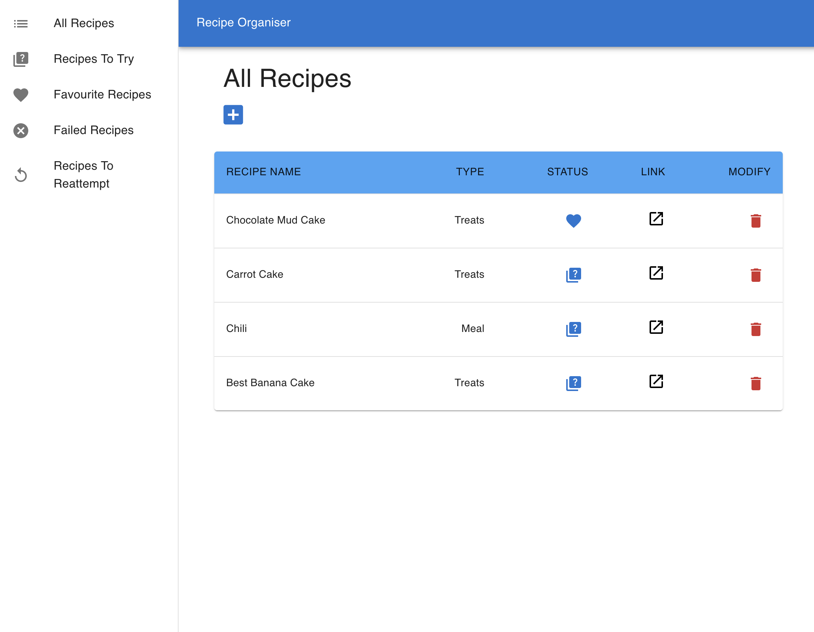
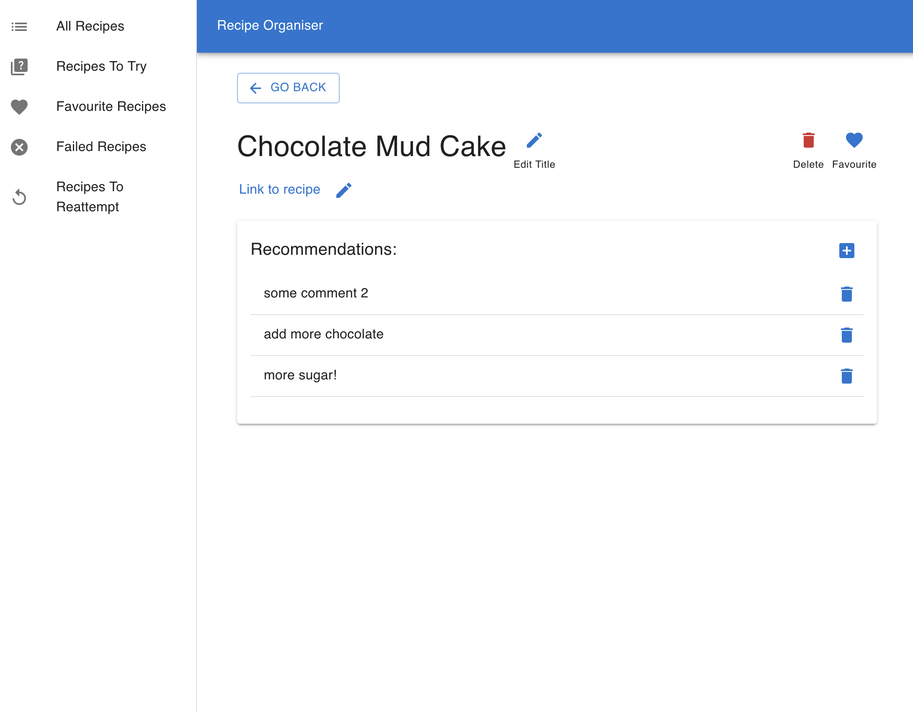
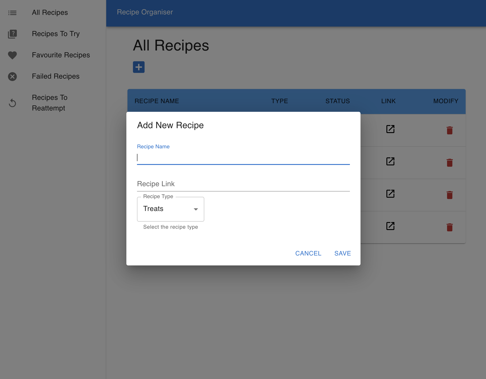

# Recipe Organiser
A project to organise your favourite recipes, utilizing React, MUI, Json-Server.
It allows users to add recipes with links to the recipe, categorise them by type and status (if they have tried the recipe yet or not), and add recommendations for the next time they make the recipe. 

## How It's Made:

**Tech used:** React, MUI, Json-Server

## Optimizations

Adding an express server to allow user creation and allow the app to work online

## Lessons Learned:

This project was used to learn MUI and React. 

## Examples:
Take a look at these other examples that I have in my portfolio:

**React Grocery List:** https://github.com/FlutterSoft/react-grocery-list

**Hackerz:** https://github.com/FlutterSoft/hackerz

**Frontend Mentor Projects:** https://github.com/FlutterSoft/FrontEndMentor

